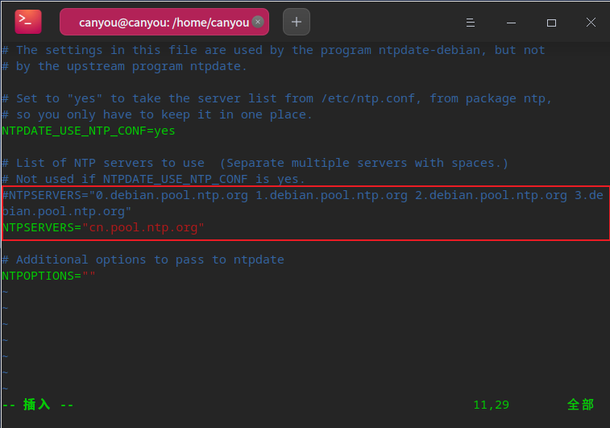

# 统信USO备赛20题

#### 忘记 ROOT 密码

###### UOS 1030 以前的版本

> 启动/重启系统时，按 e ，进入 grub 界面
>
> 
>
> 

> 光标向下移动，找到 linux /vmlinuz 开头所在行，再找到 `ro splash quiet`
>
> 

> 修改 `ro splash quiet` 为 `rw  splash quiet init=/bin/bash`
>
> 

> 修改完后，按 Ctrl + X 或 F10 继续启动

进入 BOOT 单用户模式后，在命令行中输入：

 ``` bash
 root (none):/# password root
 ```

重启 Linux 即可登录 root 用户

*参考资料* 

- [解决kali默认不能root用户登录](https://blog.csdn.net/weixin_45571987/article/details/115487088 "解决kali默认不能root用户登录")

以上方法不适用于 UOS 1031 以后的版本，系统会照常启动

###### UOS 1031 以后的版本

首先需要制作 UOS 安装盘

进入 [deepin 官网]("https://www.deepin.org/zh/download/") ，找到 **深度启动盘制作工具** 选择 官方下载

......

(以下操作在虚拟机中进行)

按 F2 进入 BIOS

> 选择 CD-ROM 优先启动
>
> 

> 按 TAB 键，配置启动
>
> 
>
> 删除 `livecd-installer`
>
> 
>
> 
>
> 配置完后，回车启动
>
> 创建目录用于挂载原先系统的root目录;
>
> > uos@UOS:~$ sudo mkdir /mnt/systmp
>
> 输入 `lsblk -f` ，查看 root 路径，root 所在路径是sda5;
>
> > uos@UOS:~$ lsblk -f
> >
> > NAME   FSTYPE  LABEL     UUID                                 FSAVAIL FSUSE% MOUNTPOINT
> > loop0  squashf                                                      0   100% /usr/lib/li
> > sda                                                                          
> > ├─sda1 ext4    Boot      8b621e9c-1e4a-44f0-91f2-1c83a2797dda                
> > ├─sda2                                                                       
> > ├─sda3 ext4    Backup    ec658bb1-0b39-4801-8c8d-3a2efd208412                
> > ├─sda4 swap    SWAP      d05021c5-0244-4aaa-9bcc-fb6400004c5c                
> > ├─sda5 ext4    Roota     bb994e9d-b251-438c-8965-371faf63a7bf                
> > ├─sda6 ext4    Rootb     62834f30-2871-495c-b118-a60923a113c5                
> > └─sda7 ext4    _dde_data e4089404-542d-4fc2-b5ca-51ac44367158                
> > sr0    iso9660 Deepin 20 2021-09-29-03-17-27-00                     0   100% /run/live/m
>
> 挂载 sda5 到 /mnt/systmp 目录下(是挂载 *Roota*目录);
>
> > uos@UOS:~$ sudo mount -t ext4 /dev/sda5 /mnt/systmp
>
> 用 chroot 命令改变当前根目录到 /mnt/systmp 下;
>
> > uos@UOS:~$ sudo chroot /mnt/systmp
>
> 用 passwd 命令修改用户密码.
>
> > root@UOS:/# passwd
>
> 修改后登录系统会提示 “您用来登录计算机的密码与登录密钥环里的密码不再匹配。”
>
> 
>
> 解决：如果登录用户正常，在显示页面有上面得图片提示，密钥环不正确，就在终端输入下面得命令删除用户的密钥环：
>
> > root@UOS:/# rm -rf /home/用户/.local/share/keyrings/login.keyring
>
> 完成后重启
>
> > root@UOS:/# reboot -f
>
> 别忘了把启动项配置回来


#### 修改主机名称

全程操作需 root 权限

**临时 **修改 hostname 为 temname

> root@uos:~# hostname tmpname

**永久** 修改 hostname 为 myhostname

> root@uos:~# hostnamectl set-hostname myhostname

更改完后，/etc/hostname 文件内容变成了 `myhostname` ，~~但是通过修改该文件来达到修改主机名的目的是不可取的~~由此推断，是否可通过更改 /etc/hostname 来达到目的

> root@uos:~# echo canyou > /etc/hostname
>
> 重启网络服务
>
> root@uos:~# systemctl restart network-manager
>
> 或者：
>
> root@uos:~# /etc/init.d/network-manager restart

打开一个新的终端，发现 hostname 已经改变

> root@canyou:~#

通过 `hostnamectl` 命令查看:

> root@uos:# hostnamectl
>
>    Static hostname: Canyou
>          Icon name: computer-vm
>            Chassis: vm
>         Machine ID: 0e5cb5666eac4d759b16eb9884feaa7e
>            Boot ID: 366da32edafc4421a9575f19badd1594
>     Virtualization: vmware
>   Operating System: Deepin 20.2.4
>             Kernel: Linux 5.10.60-amd64-desktop
>       Architecture: x86-64


#### 查询网络设定

###### 查看 IP 地址

> root@Canyou:~# ifconfig
>
> ens33: flags=4163<UP,BROADCAST,RUNNING,MULTICAST>  mtu 1500
>         `inet 192.168.116.137`  netmask 255.255.255.0  broadcast 192.168.116.255
>         inet6 fe80::81f0:e289:739a:a9ef  prefixlen 64  scopeid 0x20<link>
>         ether 00:0c:29:b1:c0:da  txqueuelen 1000  (Ethernet)
>         RX packets 240768  bytes 341045804 (325.2 MiB)
>         RX errors 0  dropped 0  overruns 0  frame 0
>         TX packets 86935  bytes 5273754 (5.0 MiB)
>         TX errors 0  dropped 0 overruns 0  carrier 0  collisions 0
>
> lo: flags=73<UP,LOOPBACK,RUNNING>  mtu 65536
>         inet 127.0.0.1  netmask 255.0.0.0
>         inet6 ::1  prefixlen 128  scopeid 0x10<host>
>         loop  txqueuelen 1000  (Local Loopback)
>         RX packets 0  bytes 0 (0.0 B)
>         RX errors 0  dropped 0  overruns 0  frame 0
>         TX packets 0  bytes 0 (0.0 B)
>         TX errors 0  dropped 0 overruns 0  carrier 0  collisions 0

###### 查看 MAC 地址

> root@Canyou:~# cat /sys/class/net/ens33/address
>
> 00:0c:29:b1:c0:da
>
> 
>
>
> root@Canyou:~# ifconfig
>
> ens33: flags=4163<UP,BROADCAST,RUNNING,MULTICAST>  mtu 1500
>         inet 192.168.116.137  netmask 255.255.255.0  broadcast 192.168.116.255
>         inet6 fe80::81f0:e289:739a:a9ef  prefixlen 64  scopeid 0x20<link>
>         `ether 00:0c:29:b1:c0:da`  txqueuelen 1000  (Ethernet)
>         RX packets 240768  bytes 341045804 (325.2 MiB)
>         RX errors 0  dropped 0  overruns 0  frame 0
>         TX packets 86935  bytes 5273754 (5.0 MiB)
>         TX errors 0  dropped 0 overruns 0  carrier 0  collisions 0
>
> lo: flags=73<UP,LOOPBACK,RUNNING>  mtu 65536
>         inet 127.0.0.1  netmask 255.0.0.0
>         inet6 ::1  prefixlen 128  scopeid 0x10<host>
>         loop  txqueuelen 1000  (Local Loopback)
>         RX packets 0  bytes 0 (0.0 B)
>         RX errors 0  dropped 0  overruns 0  frame 0
>         TX packets 0  bytes 0 (0.0 B)
>         TX errors 0  dropped 0 overruns 0  carrier 0  collisions 0

###### 查看 netmask

> root@Canyou:~# ifconfig
>
> ens33: flags=4163<UP,BROADCAST,RUNNING,MULTICAST>  mtu 1500
>         inet 192.168.116.137  `netmask 255.255.255.0`  broadcast 192.168.116.255
>         inet6 fe80::81f0:e289:739a:a9ef  prefixlen 64  scopeid 0x20<link>
>         ether 00:0c:29:b1:c0:da  txqueuelen 1000  (Ethernet)
>         RX packets 240768  bytes 341045804 (325.2 MiB)
>         RX errors 0  dropped 0  overruns 0  frame 0
>         TX packets 86935  bytes 5273754 (5.0 MiB)
>         TX errors 0  dropped 0 overruns 0  carrier 0  collisions 0
>
> lo: flags=73<UP,LOOPBACK,RUNNING>  mtu 65536
>         inet 127.0.0.1  netmask 255.0.0.0
>         inet6 ::1  prefixlen 128  scopeid 0x10<host>
>         loop  txqueuelen 1000  (Local Loopback)
>         RX packets 0  bytes 0 (0.0 B)
>         RX errors 0  dropped 0  overruns 0  frame 0
>         TX packets 0  bytes 0 (0.0 B)
>         TX errors 0  dropped 0 overruns 0  carrier 0  collisions 0

###### 查看 gateway

> root@Canyou:~# netstat -rn
>
> Kernel IP routing table
> Destination     Gateway         Genmask         Flags   MSS Window  irtt Iface
> 0.0.0.0         192.168.116.2   0.0.0.0         UG        0 0          0 ens33
> 192.168.116.0   0.0.0.0         255.255.255.0   U         0 0          0 ens33
>
> root@Canyou:~# route -n
>Kernel IP routing table
> Destination     Gateway         Genmask         Flags Metric Ref    Use Iface
> 0.0.0.0         192.168.116.2   0.0.0.0         UG    100    0        0 ens33
> 192.168.116.0   0.0.0.0         255.255.255.0   U     100    0        0 ens33

> netstat
>
> -r或--route：显示Routing Table； 
>
> -n或--numeric：直接使用ip地址，而不通过域名服务器；

> route
>
> -n：不执行DNS反向查找，直接显示数字形式的IP地址；

###### 查看 DNS

> root@Canyou:~# cat /etc/resolv.conf
>
> \# Generated by NetworkManager
> search localdomain
> nameserver 192.168.116.2
>
> root@Canyou:~# cat /etc/resolv.conf | grep nameserver  
> nameserver 192.168.116.2


#### 软件源修改

> 软件源配置文件 /etc/apt/sources.list

备份软件源：

> root@Canyou:~# cp /etc/apt/sources.list /etc/apt/sources.list.bak

更改软件源为 `网易`

> vim /etc/apt/sources.list
>
> deb http://mirrors.163.com/deepin/ apricot main contrib non-free

更新

> root@Canyou:~# apt update


#### 安装软件

> root@Canyou:~# apt install vim
>
>
> root@Canyou:~# apt -y install vim


#### 设置 NTP 时间同步

安装 ntpdate

> root@Canyou:~# apt install ntpdate

显示 ntpdate 软件包目录信息

> root@Canyou:~# dpkg -L nptdate
>
> /.
> /etc
> /etc/default
> /etc/default/ntpdate
> /etc/dhcp
> /etc/dhcp/dhclient-exit-hooks.d
> /etc/dhcp/dhclient-exit-hooks.d/ntpdate
> /etc/logcheck
> /etc/logcheck/ignore.d.server
> /etc/logcheck/ignore.d.server/ntpdate
> /usr
> /usr/sbin
> /usr/sbin/ntpdate
> /usr/sbin/ntpdate-debian
> /usr/share
> /usr/share/doc
> /usr/share/doc/ntpdate
> /usr/share/doc/ntpdate/NEWS.Debian.gz
> /usr/share/doc/ntpdate/README.Debian
> /usr/share/doc/ntpdate/changelog.Debian.gz
> /usr/share/doc/ntpdate/changelog.gz
> /usr/share/doc/ntpdate/copyright
> /usr/share/man
> /usr/share/man/man8
> /usr/share/man/man8/ntpdate-debian.8.gz
> /usr/share/man/man8/ntpdate.8.gz

使用 ntpdate 同步 cn.pool.ctp.org

> root@Canyou:~# vim /etc/default/ntpdate
>
> 将原有的注释掉，加入 `NTPSERVERS="cn.pool.ntp.org"`
>
> 

可通过 `man ntpdate` 查看命令帮助手册

`crontab` 是用来定期执行程序的命令

`crontab -l` 查看该用户定时执行的任务  
`crontab -e` 编辑

配合cron命令，来进行定期同步设置。在crontab中添加：`0 12 * * * * /usr/sbin/ntpdate 192.168.0.1 ` ，这样会在每天的12点整，同步一次时间。ntp服务器为192.168.0.1。

或者，`*  */1  *  *  * ntpdate 0.asia.pool.ntp.org` ，每隔1小时同步一次时间。


#### 文件的操作

> root@uos:~# setfacl -m u:canyou:r /home/canyou/test
>
> root@uos:~# setfacl -m u:canyou:rw /home/canyou/test
>
> root@uos:~# setfacl -m g:canyou:0 /home/canyou/test
>
> 
>
>
> root@uos:~# setfacl -x u:canyou /home/canyou/test
>
>
> root@uos:~# getfctl /home/canyou/test


#### 设置计划任务

\- 对uosmaster1 设置计划任务，每天23点59分，执行/bin/echo “UOS is the best system”

``` bash
root@uos:~# crontab -e  -u  uosmaster1
59  23 *  *  *  /bin/echo "UOS is the best system"
【:wq】
no crontab for uosmaster1 - using an empty one
crontab: installing new crontab
root@uos:~# crontab -l  -u  uosmaster1

```


#### 文件查找

\- 查找名为 “passwd”的文件，

\- 并把此文件的绝对路径写入/opt/pwdin.txt中

``` bash
root@uos:~# find /  -name passwd >  exam-uos-file.conf
find: ‘/run/user/1000/gvfs’: 权限不够
root@uos:~# cat exam-uos-file.conf
/etc/pam.d/passwd
/etc/cron.daily/passwd
/etc/passwd
/data/root/etc/passwd
/root/etc/passwd
/usr/bin/passwd
/usr/share/bash-completion/completions/passwd
/usr/share/doc/passwd
/usr/share/lintian/overrides/passwd

```


#### 文件的保护

\- 进入 /opt/ 目录，创建 uniontech.txt 文件,内容为：'UOS is the best system'

\- 要求该文件 /opt/uniontech.txt ，不能被删除，不能被修改

``` bash
root@uos:~# echo 'UOS is the best system'  >> /opt/uniontech.txt  
root@uos:~# cat /opt/uniontech.txt
UOS is the best system

root@uos:~# chattr  +ia  /opt/uniontech.txt
root@uos:~# lsattr 
root@uos:~# lsattr  /opt/uniontech.txt 
----ia--------e---- /opt/uniontech.txt

root@uos:~# rm /opt/uniontech.txt
rm: 无法删除'/opt/uniontech.txt': 不允许的操作


```

> chattr
>
> a：让文件或目录仅供附加用途；
>
> i：不得任意更动文件或目录；
>
> > root@uos:~# chattr -ia /opt/uniontech.txt

#### 字符串的查找

\- 查找 /opt目录下所有文件中包含“happyexam”的字符串，

\- 并把查找出来的行号写入/opt/findcode.txt（注意：只写行号）

``` bash
root@uos:~# grep -rn  "happyexam"   /opt/  >  /opt/findcode.txt 
grep: 输入文件 ‘/opt/findcode.txt’ 同时也作输出
root@uos:~# cat /opt/findcode.txt
/opt/b.txt:1:happyexam
root@uos:~#vim  /opt/findcode.txt  //修改内容，只留行号
1

```

> grep
>
> -r -R/-r  --recursive       # 此参数的效果和指定“-d recurse”参数相同。
>
> -d<进行动作> --directories=<动作>  # 当指定要查找的是目录而非文件时，必须使用这项参数，否则grep命令将回报信息并停止动作。
>
> -n --line-number         # 在显示符合范本样式的那一列之前，标示出该列的编号。


#### 磁盘分区

 对24G的磁盘/dev/sdb，分4个大小为5G的分区和1个大小为4G的分区

5个可以存数据的分区

``` bash
# fdisk  /dev/sdb
n  回车  回车  回车  +5G   //主分区
n  回车  回车  回车  +5G  //主分区
n  回车  回车  回车  +5G  //主分区

n  回车  回车  回车  回车     //剩余所有的空间都给扩展分区 Extended
n  回车  5G    //逻辑分区
n  回车  回车  回车      //逻辑分区
w    //保存并退出

# lsblk 查看分区
# partprobe   刷新分区

fdisk  -l   //查看分区表
```

> **知识点：**
>
> 在计算机上使用磁盘空间的过程：
>
> 识别硬盘 => 分区规划 => 格式化 => 挂载使用
>
> 毛坯房    打隔断   装修    入驻
>
> ​      MBR/msdos  EXT4|XFS
>
> 识别磁盘 --> 分区 --> 格式化 --> 挂载 --> 访问挂载点
>
> fdisk -l/lsblk --> fdisk/parted --> mkfs相关 --> mount --> ls、vim
>
> 考试时只有一块/dev/vda
>
>  
>
> 分区模式msdos：四个主分区、扩展分区、逻辑分区
>
> ​        最大支持容量为 2.2TB 的磁盘
>
> 分区模式gpt（支持>2T空间）：主分区（操作系统支持一般<128个）
>
> ​        最大支持容量为18EB
>
> ​    1EB=1024PB
>
> ​       1PB=1024TB
>
> ​       1TB=1024GB
>
> ​       1GB=1024MB
>
>  
>
> 磁盘分区操作 ——
>
> fdisk -l  //查看分区表
>
> fdisk /dev/vdb 
>
>  
>
> 刷新硬盘分区表：
>
>    partprobe /dev/vdb 或者 partx -a /dev/vdb
>
>  
>
> 查看系统所有的磁盘设备  
>
> [root@uos ~]# lsblk 
>
> NAME  MAJ:MIN RM SIZE RO TYPE MOUNTPOINT
>
> sda  253:0  0 10G 0 disk 
>
> └─sda1 253:1  0 10G 0 part /
>
> sdb  253:16  0 10G 0 disk 
>
>  
>
>  
>
> 格式化操作：
>
>  mkfs 工具集 （make file system）
>
> mkfs.ext3  分区设备
>
> mkfs.ext4  分区设备
>
> mkfs.xfs  分区设备
>
> mkfs.vfat -F 32 分区设备
>
>  
>
> 总结：
>
>   1、查看磁盘 lsblk
>
> ​     2、划分分区 fdisk
>
> ​     3、刷新  partprobe
>
> ​     4、格式化 mkfs.ext4 mkfs.xfs
>
> ​     5、查看文件系统 blkid
>
> ​     6、挂载使用 mount


#### RAID的创建

Redundant Array of Independent Disks 独立冗余磁盘阵列

mdadm multiple device admin 用于管理 RAID磁盘阵列组

 

\- 对上一题划分的4块大小为5G的分区进行RAID5创建，预留最大空间(大于14G)，路径名称为“/dev/md5”

\- 创建完后将raid5信息写入/etc/mdadm.conf文件中

\- 执行 update-initramfs -u，否则重启后raid5名称会发生变化

``` bash
安装mdadm
root@uos:~# apt install -y mdadm

root@uos:~# mdadm  -C  /dev/md5  -a  yes  -l  5   -n  4  /dev/sdb1 /dev/sdb2 /dev/sdb3 /dev/sdb5 
mdadm: Defaulting to version 1.2 metadata
mdadm: array /dev/md5 started.

root@uos:~# mdadm  -D /dev/md5  >>  /etc/mdadm.conf 

```

> +++++++++如raid创建错误，删除linux软raid方法++++++++++++++
>
> 1.先umount组建好的raid:umount /dev/md5
>
> 2.停止raid设备：mdadm -S /dev/md5
>
> 3.此时如果忘了raid中的硬盘名称，要么重启系统，要么运行:mdadm -A -s /dev/md5 然后再用mdadm -D /dev/md5查看raid中包含哪几个硬盘。再次运行第二步停止命令:mdadm -S /dev/md5
>
> 4.删除raid里的所有硬盘：mdadm --misc --zero-superblock /dev/sdc,
>
> ​            mdadm --misc --zero-superblock /dev/sdd
>
> ​            mdadm --misc --zero-superblock /dev/sde
>
> ​            mdadm --misc --zero-superblock /dev/sdf
>
>  
>
> 有几块硬盘，就按格式删几次，注意最后面的硬盘名称。
>
> 5.删除配置文件：rm -f /etc/mdadm.conf
>
> 6.如果之前将raid相关信息写入了/etc/fstab配置文件中，还需vim /etc/fstab，将raid相关的内容删除即可。


#### 对新加磁盘阵列“md5”进行逻辑卷制作

**pvcreate****命令** 用于将物理硬盘分区初始化为物理卷，以便LVM使用。

LVM **Logical Volume Manager****（逻辑卷管理）**

vgcreate 用于创建LVM卷组 （volume group）

lvcreate 用于创建LVM的逻辑卷

lvs 报告有关逻辑卷的信息

 

\- 新建物理卷，使用“md5”

\- 新建卷组，名称为“uosvg”

\- 新建逻辑卷，使用所有卷组容量(大于1.4G)，名称“uoslv”

``` bash
root@uos:~# pvcreate  /dev/md5 
  Physical volume "/dev/md5" successfully created.
root@uos:~# vgcreate  uosvg   /dev/md5
  Volume group "uosvg" successfully created
root@uos:~# lvcreate  -l +100%free uosvg   -n  uoslv
  Logical volume "uoslv" created.
root@uos:~# lvs
  LV    VG    Attr       LSize  Pool Origin Data%  Meta%  Move Log Cpy%Sync Convert
  uoslv uosvg -wi-a----- 14.98g 

```

> **知识点： raid** **硬盘化零为整， lvm** **分区化零为整**
>
> LVM逻辑卷管理机制
>
> —— 化零为整、动态伸缩
>
>  
>
> 新建逻辑卷：将众多的物理卷（pv）组成卷组（vg），再从卷组中划分逻辑卷（lv）
>
> 物理卷            卷组           逻辑卷
>
> Physical Volume   Volume Group      Logical Volume
>
>  
>
> 游击队 ===》 八路军 ===》按需增编/简编人员
>
>  
>
> 把零散的分区（PV物理设备） ===》整编的大卷组（VG虚拟磁盘） ===》 根据需要获取空间（虚拟分区LV）
>
>  
>
> 识别磁盘 --> 分区 --> 物理卷--》卷组 --> 逻辑卷 --> 格式化 --> 挂载 --> 访问挂载点
>
>  
>
>  
>
> LVM管理工具 ——
>
>   物理卷操作：pvscan、pvdisplay、pvcreate
>
>   卷组操作：vgscan、vgdisplay、vgcreate、vgremove、
>
> ​           vgextend、vgchange
>
>   逻辑卷操作：lvscan、lvdisplay、lvcreate、lvremove、lvextend
>
>  
>
> *scan 查看基本信息
>
> *display 显示详细信息
>
> *create 创建
>
> *remove 移除
>
> *extend 扩展
>
>  


#### 格式化新添加的逻辑卷并挂载

\- 对新添加的逻辑卷进行文件格式化“ext4”

\- 创建目录/opt/data

\- 挂载新添加的逻辑卷到上步创建的目录

``` bash
root@uos:~# lvscan 
  ACTIVE            '/dev/uosvg/uoslv' [14.98 GiB] inherit

root@uos:~# mkfs.ext4  /dev/uosvg/uoslv

root@uos:~# blkid  /dev/uosvg/uoslv
/dev/uosvg/uoslv: UUID="002cbcfc-7c80-4fca-9192-401aa84039fd" TYPE="ext4"
root@uos:~# mkdir /opt/data

root@uos:~# vim /etc/fstab 
root@uos:~# tail -1 /etc/fstab
/dev/uosvg/uoslv        /opt/data       ext4    defaults        0       0
root@uos:~# mount -a
root@uos:~# df -hT
文件系统                类型               容量  已用  可用 已用% 挂载点
.. ..
/dev/mapper/uosvg-uoslv ext4                15G   41M   14G    1% /opt/data

```


#### 在线扩容

使用13题(磁盘分区)划分的4G分区，对/opt/data 进行在线扩容

识别磁盘 --> 分区 --> 物理卷--》卷组 --> 逻辑卷 --> 格式化 --> 挂载  --> 访问挂载点

``` bash

root@uos:~# lsblk
... ...
└─sdb6              8:22   0     4G  0 part  
sr0                11:0    1  1024M  0 rom   
root@uos:~# pvcreate  /dev/sdb6
  Physical volume "/dev/sdb6" successfully created.
root@uos:~# vgextend  uosvg /dev/sdb6
  Volume group "uosvg" successfully extended
root@uos:~# vgs
  VG    #PV #LV #SN Attr   VSize   VFree 
  uosvg   2   1   0 wz--n- <18.98g <4.00g
root@uos:~# lvs
  LV    VG    Attr       LSize  Pool Origin Data%  Meta%  Move Log Cpy%Sync Convert
  uoslv uosvg -wi-ao---- 14.98g                                                    
root@uos:~# lvscan 
  ACTIVE            '/dev/uosvg/uoslv' [14.98 GiB] inherit
root@uos:~# lvextend  -r  /dev/uosvg/uoslv  /dev/sdb6 

root@uos:~# lvs
  LV    VG    Attr       LSize   Pool Origin Data%  Meta%  Move Log Cpy%Sync Convert
  uoslv uosvg -wi-ao---- <18.98g  

```


#### 开机自动挂载【见16题】（格式化新添加的逻辑卷并挂载）

修改fstab配置文件实现对新扩容的磁盘阵列的**开机自动挂载**

> **知识点：**
>
> 实现开机自动挂载
>
> 配置文件 /etc/fstab 的记录格式
>
> 设备路径   挂载点  类型  参数   备份标记  检测顺序 
>
> /dev/sdb1 /mypart1  ext4  defdaults   0     0
>
>  
>
>  
>
> **挂载的限制** 
>
> 1、根目录是必须挂载的，而且一定要先于其他mount point被挂载。
>
>   因为mount是所有目录的根目录，其他目录都是由根目录 /衍生出来的。
>
> 2、挂载点必须是已经存在的目录。
>
> 3、挂载点的指定可以任意，但必须遵守必要的系统目录架构原则
>
> 4、所有挂载点在同一时间只能被挂载一次
>
> 5、所有分区在同一时间只能挂在一次
>
> 6、若进行卸载，必须将工作目录退出挂载点（及其子目录）之外。


#### 文件的打包与拆解

\- 从http://www.firefox.com.cn/下载Firefox-latest-x86_64.tar

\- 对Firefox-latest-x86_64.tar.bz2 进行解包，解压后的目录移动到/opt/data下

\- 对/opt/data目录进行打包 ，打包完的名称为“data.tar.gz”存放位置在/opt目录下

``` bash
root@uos:~# tar -jxvf  Firefox-latest-x86_64.tar.bz2   -C  /opt/data/
root@uos:~# tar -zcvf   /opt/data.tar.gz    /opt/data/

```

> **涉及知识点：**
>
> Linux系统的文档备份/恢复 ——
>
> 归档：把很多文件归纳到一起   tar
>
> 压缩：减小文件占用空间的大小  gzip、bzip2、xz 
>
> **tar****命令的选项：**
>
>   -c：创建新文档
>
>   -x：释放备份文档
>
>   -f：指定文档名称
>
>   -z：处理 .gz 格式
>
>   -j：处理 .bz2 格式
>
>   -J：处理 .xz 格式
>
>   -t：显示文档列表
>
>   -p：保持原有权限
>
>   -P：保持绝对路径
>
>   -C：指定释放备份文件时的目标位置
>
>   --exclude=排除的子目录
>
> **tar** **制作备份文件：**
>
>   tar -zcf 备份文件名.tar.gz 被备份的文档....
>
>   tar -jcf 备份文件名.tar.bz2 被备份的文档....
>
>   tar -Jcf 备份文件名.tar.xz 被备份的文档....
>
> **tar** **从备份文件恢复：**
>
>   tar -xf 备份文件名  [-C 目标文件夹]
>
>  
>
> **tar** **查看备份文件内容：**
>
>   tar -tf 备份文件名
>
>  
>
> -P 保持绝对路径
>
> file:用于辨识文件类型


#### 使用systemctl命令设置服务的开机自启动

\- 检查sshd配置，要求允许root登陆并重启sshd

\- 检查sshd配置，要求设置使用DNS反查为no   

\- 添加ssh服务到开启自启动

ssh 远程链接

``` bash
root@uos:~# vim /etc/ssh/sshd_config 
PermitRootLogin  yes
UseDNS no

root@uos:~# systemctl restart ssh
root@uos:~# systemctl enable  ssh


```
禁止自启动
> root@uos:~# systemctl disable ssh


## 补充

Deepin 是基于 `Debian` 的系统

---

###### Deepin 根目录下文件夹

| 目录        | 描述                                                         |
| ----------- | ------------------------------------------------------------ |
| /bin        | bin 是 Binaries (二进制文件) 的缩写, 这个目录存放着最经常使用的命令。 |
| /boot       | 这里存放的是启动 Linux 时使用的一些核心文件，包括一些连接文件以及镜像文件。 |
| /build      |                                                              |
| /data       |                                                              |
| /dev        | dev 是 Device(设备) 的缩写, 该目录下存放的是 Linux 的外部设备，在 Linux 中访问设备的方式和访问文件的方式是相同的。 |
| /etc        | etc 是 Etcetera(等等) 的缩写,这个目录用来存放所有的系统管理所需要的配置文件和子目录。 |
| /home       | 用户的主目录，在 Linux 中，每个用户都有一个自己的目录，一般该目录名是以用户的账号命名的. |
| /lib        | lib 是 Library(库) 的缩写这个目录里存放着系统最基本的动态连接共享库，其作用类似于 Windows 里的 DLL 文件。几乎所有的应用程序都需要用到这些共享库。 |
| /lost+found | 这个目录一般情况下是空的，当系统非法关机后，这里就存放了一些文件。 |
| /media      | linux 系统会自动识别一些设备，例如U盘、光驱等等，当识别后，Linux 会把识别的设备挂载到这个目录下。 |
| /mnt        | 系统提供该目录是为了让用户临时挂载别的文件系统的，我们可以将光驱挂载在 /mnt/ 上，然后进入该目录就可以查看光驱里的内容了。 |
| /opt        | opt 是 optional(可选) 的缩写，这是给主机额外安装软件所摆放的目录。比如你安装一个ORACLE数据库则就可以放到这个目录下。默认是空的。 |
| /proc       | proc 是 Processes(进程) 的缩写，/proc 是一种伪文件系统（也即虚拟文件系统），存储的是当前内核运行状态的一系列特殊文件，这个目录是一个虚拟的目录，它是系统内存的映射，我们可以通过直接访问这个目录来获取系统信息。<br />这个目录的内容不在硬盘上而是在内存里，我们也可以直接修改里面的某些文件，比如可以通过下面的命令来屏蔽主机的ping命令，使别人无法ping你的机器：<br /> echo 1 > /proc/sys/net/ipv4/icmp_echo_ignore_all |
| /recovery   |                                                              |
| /root       | 该目录为系统管理员，也称作超级权限者的用户主目录。           |
| /run        | 是一个临时文件系统，存储系统启动以来的信息。当系统重启时，这个目录下的文件应该被删掉或清除。如果你的系统上有 /var/run 目录，应该让它指向 run。 |
| /sbin       | s 就是 Super User 的意思，是 Superuser Binaries (超级用户的二进制文件) 的缩写，这里存放的是系统管理员使用的系统管理程序。 |
| /selinux    | 这个目录是 Redhat/CentOS 所特有的目录，Selinux 是一个安全机制，类似于 windows 的防火墙，但是这套机制比较复杂，这个目录就是存放selinux相关的文件的。 |
| /srv        | 该目录存放一些服务启动之后需要提取的数据。                   |
| /sys        | 这是 Linux2.6 内核的一个很大的变化。该目录下安装了 2.6 内核中新出现的一个文件系统 sysfs 。<br />sysfs 文件系统集成了下面3种文件系统的信息：针对进程信息的 proc 文件系统、针对设备的 devfs 文件系统以及针对伪终端的 devpts 文件系统。<br />该文件系统是内核设备树的一个直观反映。<br />当一个内核对象被创建的时候，对应的文件和目录也在内核对象子系统中被创建。 |
| /tmp        | tmp 是 temporary(临时) 的缩写这个目录是用来存放一些临时文件的。 |
| /usr        | usr 是 unix shared resources(共享资源) 的缩写，这是一个非常重要的目录，用户的很多应用程序和文件都放在这个目录下，类似于 windows 下的 program files 目录。<br />/usr/bin: 系统用户使用的应用程序。<br />/usr/sbin: 超级用户使用的比较高级的管理程序和系统守护程序。<br />/usr/src: 内核源代码默认的放置目录。 |
| /var        | var 是 variable(变量) 的缩写，这个目录中存放着在不断扩充着的东西，我们习惯将那些经常被修改的目录放在这个目录下。包括各种日志文件。 |


###### /etc/init.d

[Linux 目录之 /etc/init.d/ 介绍](https://blog.csdn.net/liaowenxiong/article/details/117083906)


