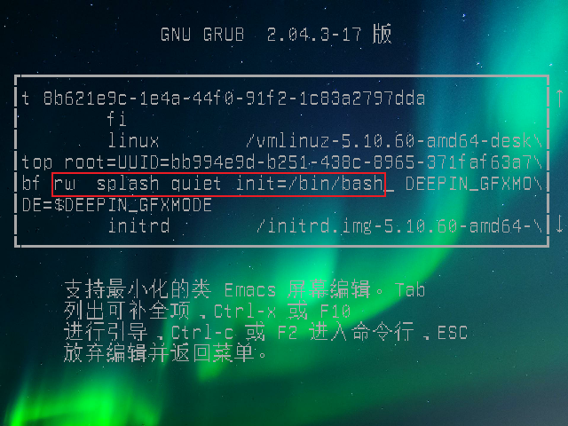
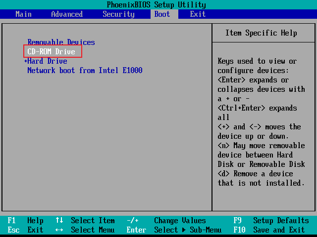
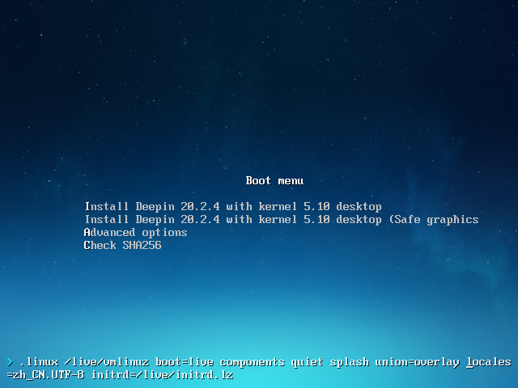
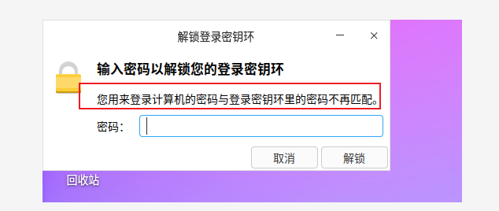

# 统信USO备赛20题

#### 忘记 ROOT 密码

###### UOS 1030 以前的版本

> 启动/重启系统时，按 e ，进入 grub 界面
>
> 
>
> 

> 光标向下移动，找到 linux /vmlinuz 开头所在行，再找到 `ro splash quiet`
>
> 

> 修改 `ro splash quiet` 为 `rw  splash quiet init=/bin/bash`
>
> 

> 修改完后，按 Ctrl + X 或 F10 继续启动

进入 BOOT 单用户模式后，在命令行中输入：

 ``` bash
 root (none):/# password root
 ```

重启 Linux 即可登录 root 用户

*参考资料* 

- [解决kali默认不能root用户登录](https://blog.csdn.net/weixin_45571987/article/details/115487088 "解决kali默认不能root用户登录")

以上方法不适用于 UOS 1031 以后的版本，系统会照常启动

###### UOS 1031 以后的版本

首先需要制作 UOS 安装盘

进入 [deepin 官网]("https://www.deepin.org/zh/download/") ，找到 **深度启动盘制作工具** 选择 官方下载

......

(以下操作在虚拟机中进行)

按 F2 进入 BIOS

> 选择 CD-ROM 优先启动
>
> 

> 按 TAB 键，配置启动
>
> 
>
> 删除 `livecd-installer`
>
> 
>
> 
>
> 配置完后，回车启动
>
> 创建目录用于挂载原先系统的root目录;
>
> > uos@UOS:~$ sudo mkdir 
>
> 输入 `lsblk -f` ，查看 root 路径，root 所在路径是sda5;
>
> > uos@UOS:~$ lsblk -f
> >
> > NAME   FSTYPE  LABEL     UUID                                 FSAVAIL FSUSE% MOUNTPOINT
> > loop0  squashf                                                      0   100% /usr/lib/li
> > sda                                                                          
> > ├─sda1 ext4    Boot      8b621e9c-1e4a-44f0-91f2-1c83a2797dda                
> > ├─sda2                                                                       
> > ├─sda3 ext4    Backup    ec658bb1-0b39-4801-8c8d-3a2efd208412                
> > ├─sda4 swap    SWAP      d05021c5-0244-4aaa-9bcc-fb6400004c5c                
> > ├─sda5 ext4    Roota     bb994e9d-b251-438c-8965-371faf63a7bf                
> > ├─sda6 ext4    Rootb     62834f30-2871-495c-b118-a60923a113c5                
> > └─sda7 ext4    _dde_data e4089404-542d-4fc2-b5ca-51ac44367158                
> > sr0    iso9660 Deepin 20 2021-09-29-03-17-27-00                     0   100% /run/live/m
>
> 挂载 sda5 到 /mnt/systmp 目录下(是挂载 *Roota*目录);
>
> > uos@UOS:~$ sudo mount -t ext4 /dev/sda5 /mnt/systmp
>
> 用 chroot 命令改变当前根目录到 /mnt/systmp 下;
>
> > uos@UOS:~$ sudo chroot /mnt/systmp
>
> 用 passwd 命令修改用户密码.
>
> > root@UOS:/# passwd
>
> 修改后登录系统会提示 “您用来登录计算机的密码与登录密钥环里的密码不再匹配。”
>
> 
>
> 解决：如果登录用户正常，在显示页面有上面得图片提示，密钥环不正确，就在终端输入下面得命令删除用户的密钥环：
>
> > root@UOS:/# rm -rf /home/用户/.local/share/keyrings/login.keyring
>
> 完成后重启
>
> > root@UOS:/# reboot -f
>
> 别忘了把启动项配置回来


#### 修改主机名称

全程操作需 root 权限

**临时 **修改 hostname 为 temname

> root@uos:~# hostname tmpname

**永久** 修改 hostname 为 myhostname

> root@uos:~# hostnamectl set-hostname myhostname

更改完后，/etc/hostname 文件内容变成了 `myhostname` ，~~但是通过修改该文件来达到修改主机名的目的是不可取的~~由此推断，是否可通过更改 /etc/hostname 来达到目的

> root@uos:~# echo canyou > /etc/hostname
>
> 重启网络服务
>
> root@uos:~# systemctl restart network-manager

打开一个新的终端，发现 hostname 已经改变

> root@canyou:~#

通过 `hostnamectl` 命令查看:

> root@uos:# hostnamectl
>
>    Static hostname: Canyou
>          Icon name: computer-vm
>            Chassis: vm
>         Machine ID: 0e5cb5666eac4d759b16eb9884feaa7e
>            Boot ID: 366da32edafc4421a9575f19badd1594
>     Virtualization: vmware
>   Operating System: Deepin 20.2.4
>             Kernel: Linux 5.10.60-amd64-desktop
>       Architecture: x86-64


#### 查询网络设定

###### 查看 IP 地址

> root@Canyou:~# ifconfig
>
> ens33: flags=4163<UP,BROADCAST,RUNNING,MULTICAST>  mtu 1500
>         `inet 192.168.116.137`  netmask 255.255.255.0  broadcast 192.168.116.255
>         inet6 fe80::81f0:e289:739a:a9ef  prefixlen 64  scopeid 0x20<link>
>         ether 00:0c:29:b1:c0:da  txqueuelen 1000  (Ethernet)
>         RX packets 240768  bytes 341045804 (325.2 MiB)
>         RX errors 0  dropped 0  overruns 0  frame 0
>         TX packets 86935  bytes 5273754 (5.0 MiB)
>         TX errors 0  dropped 0 overruns 0  carrier 0  collisions 0
>
> lo: flags=73<UP,LOOPBACK,RUNNING>  mtu 65536
>         inet 127.0.0.1  netmask 255.0.0.0
>         inet6 ::1  prefixlen 128  scopeid 0x10<host>
>         loop  txqueuelen 1000  (Local Loopback)
>         RX packets 0  bytes 0 (0.0 B)
>         RX errors 0  dropped 0  overruns 0  frame 0
>         TX packets 0  bytes 0 (0.0 B)
>         TX errors 0  dropped 0 overruns 0  carrier 0  collisions 0

###### 查看 MAC 地址

> root@Canyou:~# cat /sys/class/net/ens33/address
>
> 00:0c:29:b1:c0:da
>
> 
>
>
> root@Canyou:~# ifconfig
>
> ens33: flags=4163<UP,BROADCAST,RUNNING,MULTICAST>  mtu 1500
>         inet 192.168.116.137  netmask 255.255.255.0  broadcast 192.168.116.255
>         inet6 fe80::81f0:e289:739a:a9ef  prefixlen 64  scopeid 0x20<link>
>         `ether 00:0c:29:b1:c0:da`  txqueuelen 1000  (Ethernet)
>         RX packets 240768  bytes 341045804 (325.2 MiB)
>         RX errors 0  dropped 0  overruns 0  frame 0
>         TX packets 86935  bytes 5273754 (5.0 MiB)
>         TX errors 0  dropped 0 overruns 0  carrier 0  collisions 0
>
> lo: flags=73<UP,LOOPBACK,RUNNING>  mtu 65536
>         inet 127.0.0.1  netmask 255.0.0.0
>         inet6 ::1  prefixlen 128  scopeid 0x10<host>
>         loop  txqueuelen 1000  (Local Loopback)
>         RX packets 0  bytes 0 (0.0 B)
>         RX errors 0  dropped 0  overruns 0  frame 0
>         TX packets 0  bytes 0 (0.0 B)
>         TX errors 0  dropped 0 overruns 0  carrier 0  collisions 0

###### 查看 netmask

> root@Canyou:~# ifconfig
>
> ens33: flags=4163<UP,BROADCAST,RUNNING,MULTICAST>  mtu 1500
>         inet 192.168.116.137  `netmask 255.255.255.0`  broadcast 192.168.116.255
>         inet6 fe80::81f0:e289:739a:a9ef  prefixlen 64  scopeid 0x20<link>
>         ether 00:0c:29:b1:c0:da  txqueuelen 1000  (Ethernet)
>         RX packets 240768  bytes 341045804 (325.2 MiB)
>         RX errors 0  dropped 0  overruns 0  frame 0
>         TX packets 86935  bytes 5273754 (5.0 MiB)
>         TX errors 0  dropped 0 overruns 0  carrier 0  collisions 0
>
> lo: flags=73<UP,LOOPBACK,RUNNING>  mtu 65536
>         inet 127.0.0.1  netmask 255.0.0.0
>         inet6 ::1  prefixlen 128  scopeid 0x10<host>
>         loop  txqueuelen 1000  (Local Loopback)
>         RX packets 0  bytes 0 (0.0 B)
>         RX errors 0  dropped 0  overruns 0  frame 0
>         TX packets 0  bytes 0 (0.0 B)
>         TX errors 0  dropped 0 overruns 0  carrier 0  collisions 0

###### 查看 gateway

> root@Canyou:~# netstart -rn
>
> Kernel IP routing table
> Destination     Gateway         Genmask         Flags   MSS Window  irtt Iface
> 0.0.0.0         192.168.116.2   0.0.0.0         UG        0 0          0 ens33
> 192.168.116.0   0.0.0.0         255.255.255.0   U         0 0          0 ens33
>
> 
>
> root@Canyou:~# route -n
> Kernel IP routing table
> Destination     Gateway         Genmask         Flags Metric Ref    Use Iface
> 0.0.0.0         192.168.116.2   0.0.0.0         UG    100    0        0 ens33
> 192.168.116.0   0.0.0.0         255.255.255.0   U     100    0        0 ens33

###### 查看 DNS

> root@Canyou:~# cat /etc/resolv.conf
>
> \# Generated by NetworkManager
> search localdomain
> nameserver 192.168.116.2
>
> root@Canyou:~# cat /etc/resolv.conf | grep nameserver
> nameserver 192.168.116.2


#### 软件源修改

> 软件源配置文件 /etc/apt/sources.list

备份软件源：

> root@Canyou:~# cp /etc/apt/sources.list /etc/apt/sources.list.bak

更改软件源为 `网易`

> vim /etc/apt/sources.list
>
> deb http://mirrors.163.com/deepin/ apricot main contrib non-free

更新

> root@Canyou:~# apt update


#### 安装软件

> root@Canyou:~# apt install vim
>
>
> root@Canyou:~$ apt -y install vim


#### 设置 NTP 时间同步

安装 ntpdate

> root@Canyou:~# apt install ntpdate


## 补充

Deepin 是基于 `Debian` 的系统

---

###### Deepin 根目录下文件夹

| 目录        | 描述                                                         |
| ----------- | ------------------------------------------------------------ |
| /bin        | bin 是 Binaries (二进制文件) 的缩写, 这个目录存放着最经常使用的命令。 |
| /boot       | 这里存放的是启动 Linux 时使用的一些核心文件，包括一些连接文件以及镜像文件。 |
| /build      |                                                              |
| /data       |                                                              |
| /dev        | dev 是 Device(设备) 的缩写, 该目录下存放的是 Linux 的外部设备，在 Linux 中访问设备的方式和访问文件的方式是相同的。 |
| /etc        | etc 是 Etcetera(等等) 的缩写,这个目录用来存放所有的系统管理所需要的配置文件和子目录。 |
| /home       | 用户的主目录，在 Linux 中，每个用户都有一个自己的目录，一般该目录名是以用户的账号命名的. |
| /lib        | lib 是 Library(库) 的缩写这个目录里存放着系统最基本的动态连接共享库，其作用类似于 Windows 里的 DLL 文件。几乎所有的应用程序都需要用到这些共享库。 |
| /lost+found | 这个目录一般情况下是空的，当系统非法关机后，这里就存放了一些文件。 |
| /media      | linux 系统会自动识别一些设备，例如U盘、光驱等等，当识别后，Linux 会把识别的设备挂载到这个目录下。 |
| /mnt        | 系统提供该目录是为了让用户临时挂载别的文件系统的，我们可以将光驱挂载在 /mnt/ 上，然后进入该目录就可以查看光驱里的内容了。 |
| /opt        | opt 是 optional(可选) 的缩写，这是给主机额外安装软件所摆放的目录。比如你安装一个ORACLE数据库则就可以放到这个目录下。默认是空的。 |
| /proc       | proc 是 Processes(进程) 的缩写，/proc 是一种伪文件系统（也即虚拟文件系统），存储的是当前内核运行状态的一系列特殊文件，这个目录是一个虚拟的目录，它是系统内存的映射，我们可以通过直接访问这个目录来获取系统信息。<br />这个目录的内容不在硬盘上而是在内存里，我们也可以直接修改里面的某些文件，比如可以通过下面的命令来屏蔽主机的ping命令，使别人无法ping你的机器：<br /> echo 1 > /proc/sys/net/ipv4/icmp_echo_ignore_all |
| /recovery   |                                                              |
| /root       | 该目录为系统管理员，也称作超级权限者的用户主目录。           |
| /run        | 是一个临时文件系统，存储系统启动以来的信息。当系统重启时，这个目录下的文件应该被删掉或清除。如果你的系统上有 /var/run 目录，应该让它指向 run。 |
| /sbin       | s 就是 Super User 的意思，是 Superuser Binaries (超级用户的二进制文件) 的缩写，这里存放的是系统管理员使用的系统管理程序。 |
| /selinux    | 这个目录是 Redhat/CentOS 所特有的目录，Selinux 是一个安全机制，类似于 windows 的防火墙，但是这套机制比较复杂，这个目录就是存放selinux相关的文件的。 |
| /srv        | 该目录存放一些服务启动之后需要提取的数据。                   |
| /sys        | 这是 Linux2.6 内核的一个很大的变化。该目录下安装了 2.6 内核中新出现的一个文件系统 sysfs 。<br />sysfs 文件系统集成了下面3种文件系统的信息：针对进程信息的 proc 文件系统、针对设备的 devfs 文件系统以及针对伪终端的 devpts 文件系统。<br />该文件系统是内核设备树的一个直观反映。<br />当一个内核对象被创建的时候，对应的文件和目录也在内核对象子系统中被创建。 |
| /tmp        | tmp 是 temporary(临时) 的缩写这个目录是用来存放一些临时文件的。 |
| /usr        | usr 是 unix shared resources(共享资源) 的缩写，这是一个非常重要的目录，用户的很多应用程序和文件都放在这个目录下，类似于 windows 下的 program files 目录。<br />/usr/bin: 系统用户使用的应用程序。<br />/usr/sbin: 超级用户使用的比较高级的管理程序和系统守护程序。<br />/usr/src: 内核源代码默认的放置目录。 |
| /var        | var 是 variable(变量) 的缩写，这个目录中存放着在不断扩充着的东西，我们习惯将那些经常被修改的目录放在这个目录下。包括各种日志文件。 |


